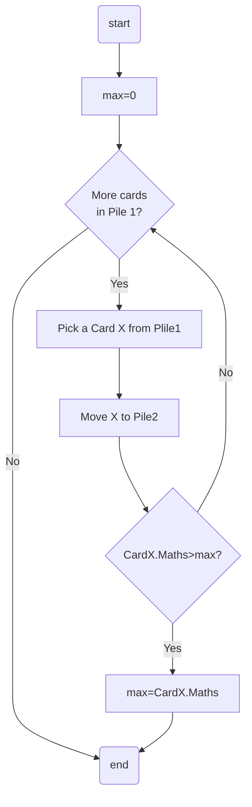
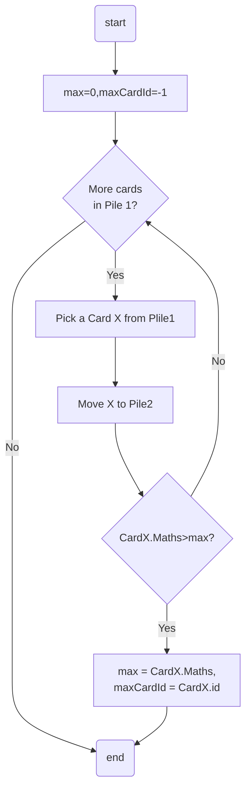
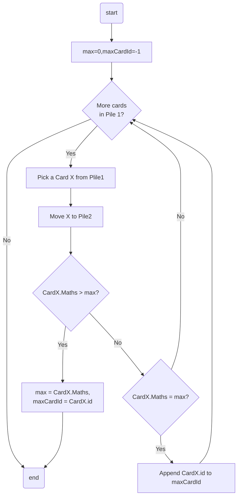
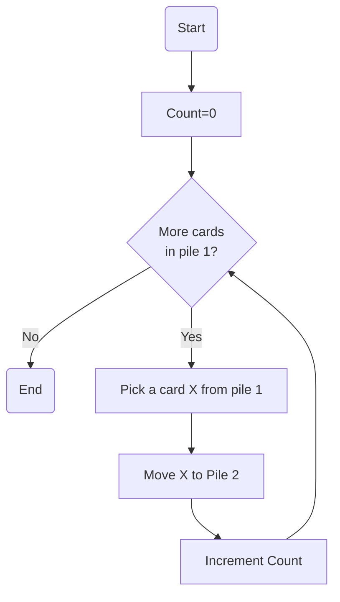

# $L2.1:$ Conditional termination in iteration

Exiting a iteration basesd on specific condition 

- $Example:$ 
  - Suppose we are looking for specific cards which have Food and Apparel from shopping bills dataset and exit after that.
    - We would have to match food and apparel in the items category list and exit after that, so we don't need to iterate after we are done wit our objective and we can exit the loop.
  - Suppose We want to find the fist verb in the third line. We have to keep track of line number first, When we reached the third line then we start looking for the verb and exit after we find the verb.

```mermaid
flowchart TD
e[End]
op1[Found= False]
op2[Found= True]
op3[Other operations]
cond1{Another card and not Found}
cond2{Correct card}

op1-->cond1-->|Yes|cond2-->|Yes|op2-->op3-->cond1
cond1-->|No|e
cond2-->|No|op3
````

# $L2.2:$ Local operations and max in a single iteration (Part 1)

- Suppose we want to find out the student has got the highest total marks
  - We have to keep track of highest marks card as we iterate through the scores dataset
  - Lets initialize a variable `max=0` since the marks can't be lower than `0`.

  - as we iterate through we see the max variable change from low to high

<center>

|max|~~0~~|~~174~~|~~209~~|~~227~~|~~254~~|~~261~~|281|
|-|-|-|-|-|-|-|-|

</center>

This is also an example of an iterator with filter in it. The filter compares the total marks in the card  and `max` variable and updates max if its smaller than the total in card.

# $L2.3:$ Local operations and max in single iteration (Part 2)

- Suppose we want to find out the longest sentence (max words).
  - We have to now keep track of two variable `count=0` and `longestSentence=0`
  - we count number of words until a word ends with `.`, Then compare `count` with `longestSentence`, if `longest sentence` is less than `count` we update it. Then we assign `count=0` and repeat untill no more words left.


|count|~~0~~|~~1~~|~~2~~|~~3~~|4|
|-|-|-|-|-|-|

|count|~~0~~|~~1~~|~~2~~|~~3~~|~~4~~|~~5~~|~~6~~|7|
|-|-|-|-|-|-|-|-|-|

|count|~~0~~|~~1~~|~~2~~|~~3~~|~~4~~|~~5~~|~~6~~|~~7~~|8|
|-|-|-|-|-|-|-|-|-|-|

|count|~~0~~|~~1~~|~~2~~|~~3~~|~~4~~|~~5~~|~~6~~|~~7~~|~~8~~|~~9~~|~~10~~|~~11~~|~~12~~|~~13~~|~~14~~|~~15~~|~~16~~|~~17~~|~~18~~|~~19~~|20|
|-|-|-|-|-|-|-|-|-|-|-|-|-|-|-|-|-|-|-|-|-|-|

|count|~~0~~|~~1~~|~~2~~|~~3~~|~~4~~|~~5~~|~~6~~|~~7~~|~~8~~|~~9~~|~~10~~|~~11~~|~~12~~|~~13~~|~~14~~|~~15~~|~~16~~|~~17~~|~~18~~|~~19~~|~~20~~|~~21~~|~~22~~|~~23~~|~~24~~|25|
|-|-|-|-|-|-|-|-|-|-|-|-|-|-|-|-|-|-|-|-|-|-|-|-|-|-|-|

|logestSentence|~~0~~|~~4~~|~~7~~|~~8~~|~~20~~|25|
|-|-|-|-|-|-|-|

# $L2.4:$ Local operations and max in single iteration (Part 3)

- Suppose we want to find out which shops are doing well. Well in the sence of number of bills they generate.
  - Since we don't know how many stors are there we are going to add a new count variable each time we see a new store.
    - The first card saw is from "SV Stores" so we add a new count variable `SV=0` and add 1 to it.

|SV|~~0~~|1|
|-|-|-|

- - - Now we see anoter new store `Big Bazar` so we add a new count variable `BB=0` and add 1 to it.

|SV|~~0~~|~~1~~|~~2~~|3|
|-|-|-|-|-|

|BB|~~0~~|~~1~~|2|
|-|-|-|-|

- - - Now we see anoter new store `Sun General` so we add a new count variable `SG=0` and add 1 to it.

|SV|~~0~~|~~1~~|~~2~~|~~3~~|~~4~~|~~5~~|~~6~~|~~7~~|~~8~~|~~9~~|~~10~~|~~11~~|~~12~~|~~13~~|~~14~~|15|
|-|-|-|-|-|-|-|-|-|-|-|-|-|-|-|-|-|

|BB|~~0~~|~~1~~|~~2~~|~~3~~|~~4~~|~~5~~|6|
|-|-|-|-|-|-|-|-|

|SG|~~0~~|~~1~~|~~2~~|~~3~~|~~4~~|~~5~~|~~6~~|~~7~~|~~8~~|9|
|-|-|-|-|-|-|-|-|-|-|-|

- - No we have to go throug another iteration to find which count is higest to find the shop that is doing well

- Suppose we want to find out the max in single iteration. so we also keep track of a variable `max=0` and update it if any seen shop bill counts have count more than max
  - Since we don't know how many stors are there we are going to add a new count variable each time we see a new store.
    - The first card saw is from "SV Stores" so we add a new count variable `SV=0` and add 1 to it.

|SV|~~0~~|1|
|-|-|-|

|max|~~0~~|1|
|-|-|-|

- - - Now we see anoter new store `Big Bazar` so we add a new count variable `BB=0` and add 1 to it.

|SV|~~0~~|~~1~~|~~2~~|3|
|-|-|-|-|-|

|BB|~~0~~|~~1~~|2|
|-|-|-|-|

|max|~~0~~|~~1~~|~~2~~|3|
|-|-|-|-|-|

- - - Now we see anoter new store `Sun General` so we add a new count variable `SG=0` and add 1 to it.

|SV|~~0~~|~~1~~|~~2~~|~~3~~|~~4~~|~~5~~|~~6~~|~~7~~|~~8~~|~~9~~|~~10~~|~~11~~|~~12~~|~~13~~|~~14~~|15|
|-|-|-|-|-|-|-|-|-|-|-|-|-|-|-|-|-|

|BB|~~0~~|~~1~~|~~2~~|~~3~~|~~4~~|~~5~~|6|
|-|-|-|-|-|-|-|-|

|SG|~~0~~|~~1~~|~~2~~|~~3~~|~~4~~|~~5~~|~~6~~|~~7~~|~~8~~|9|
|-|-|-|-|-|-|-|-|-|-|-|

|max|~~0~~|~~1~~|~~2~~|~~3~~|~~4~~|~~5~~|~~6~~|~~7~~|~~8~~|~~9~~|~~10~~|~~11~~|~~12~~|~~13~~|~~14~~|15|
|-|-|-|-|-|-|-|-|-|-|-|-|-|-|-|-|-|

# $L2.5:$ Local operations and max in single iteration (Part 4)

- When we were counting the bills we noticed that even though sv stores was producing ig number of bills but the total value of eac bill was less compared to Big Bazar.
- so the sum of total bill amount may be the better indicator of which shop is doing better.

  - Since we don't know how many stors are there we are going to add a new sum variable each time we see a new store.
    - The first card saw is from "SV Stores" so we add a new count variable `SV=0` and add the total value of card to it.

|SV|~~0~~|567|
|-|-|-|

|max|~~0~~|567|
|-|-|-|

- - - Now we see anoter new store `Big Bazar` so we add a new sum variable `BB=0` and add the total value of card to it.

|SV|~~0~~|~~567~~|~~1908~~|2031|
|-|-|-|-|-|

|BB|~~0~~|~~1525~~|5699|
|-|-|-|-|

|max|~~0~~|~~567~~|~~1525~~|~~1908~~|~~2031~~|5699|
|-|-|-|-|-|-|-|

- - - Now we see anoter new store `Sun General` so we add a new sum variable `SG=0` and add total value of card to it.

|SV|~~0~~|~~567~~|~~1908~~|~~2031~~|~~2127~~|~~3020~~|~~3299~~|~~3902~~|~~4494~~|~~5116~~|~~5244~~|~~6132~~|~~6224~~|~~6500~~|~~7014~~|7120|
|-|-|-|-|-|-|-|-|-|-|-|-|-|-|-|-|-|

|BB|~~0~~|~~1525~~|~~5699~~|~~8831~~|~~9426~~|~~12486~~|13284|
|-|-|-|-|-|-|-|-|

|SG|~~0~~|~~354~~|~~732~~|~~918~~|~~1574~~|~~1803~~|~~1990~~|~~2305~~|~~3669~~|4009|
|-|-|-|-|-|-|-|-|-|-|-|

|max|~~0~~|~~567~~|~~1525~~|~~1908~~|~~2031~~|~~5699~~|~~8831~~|~~9426~~|~~12486~~|13284|
|-|-|-|-|-|-|-|-|-|-|-|

# $L2.6:$ Max in a single iteration and max in two iterations (non-nested)

- $Example:$ It was Monday morning. Swaminathan was reluctant to open his eyes. He considered Monday specially unpleasant in the calendar. After the delicious freedom of Saturday and Sunday, it was difficult to get into the Monday mood of work and discipline. He suddered at the very thougt of school: that dismal yellow building; the fire-eyed Vedanayagam, his class-teacher; and the Head Master with his thin long cane...
<center>

|Word|count|Word|count|Word|count|Word|count|
|-|-|-|-|-|-|-|-|
|It|2|specially|1|get|1|building|1|
|was|3|unpleasant|1|into|1|fire-eyed|1|
|Monday|3|in|1|mood|1|Vedanayagam|1|
|morning|1|the|6|work|1|class-teacher|1|
|Swaminathan|1|calendar|1|discipline|1|Head|1|
|reluctant|1|After|1|suddered|1|Master|1|
|to|2|delicious|1|at|1|with|1|
|open|1|freedom|1|very|1|thin|1|
|his|2|of|3|thought|1|long|1|
|eyes|1|Saturday|1|school|1|cane|1|
|He|2|and|3|that|1|difficult|1|
|considered|1|Sunday|1|dismal|1|yellow|1|

|Max-frequency|~~1~~|~~2~~|~~3~~|~~4~~|~~5~~|6|
|-|-|-|-|-|-|-|
</center>

# $L2.7:$ Max in a single iteration witout losing information and applications of frequency count.

- Suppose we want to find out the max Math marks and the card ID which got the max Math marks.
  - We keep track of two variables `maxMaths=0` and `maxCardNo=-1`

<center>

|maxMaths|~~0~~|~~68~~|~~87~~|97|
|-|-|-|-|-|

|maxCardNo|~~-1~~|~~0~~|~~4~~|11,23|
|-|-|-|-|-|

</center>

- From the word count example from $L2.6$ the words that occur more than once are

<center>

|Word|it|was|monday|to|his|he|the|of|and|
|-|-|-|-|-|-|-|-|-|-|
|Frequency|2|3|3|2|2|2|6|3|3|

</center>

- Infrequent words are useful to categorize or rank same type of document. For example when we search a term in a searc engine, it ranks results better if it has unique words.

# $L2.8:$ Flowchart for max marks

## Basic Flowchart for filtering
<center>

```mermaid
flowchart TD
st(start)
ed(end)
id1[Initialize]
id2[Pick a Card X from Plile1]
id3[Move X to Pile2]
id4[Do something for No]
id5[Do something for Yes]
cond1{More cards\n in Pile 1?}
cond2{Check for ?}

st-->id1-->cond1-->|No|ed
cond1-->|Yes|id2-->id3-->cond2-->|Yes|id5-->ed
cond2-->|No|id4-->ed
```

</center>

### We will try to edit it to find max Maths Marks
<center>



</center>

### Max of Maths marks: keep track of card
<center>



</center>

### Max of Maths marks: keep track of card list
<center>



</center>

# $L2.9:$ Introduction to pseudocodes

## Floecharts

- Pictorial representation of computational process
  - Counting the number of cards
- Node types
  - Process
  - Decision
  - Terminal
- Arrows indicate operation flow

### Advantages

- Visual representation of computation
- Easy to understand

### Disadvantages

- Size: Complex process generate large flowcharts
- Collaboration: Sharing pictures in editable format
- Versions: Comparing changes between flowcharts

## From pictures to text

<center>
    


</center>

### Describe process in words

$Step\ 0:$ Start <br>
$Step\ 1:$ Initialize Count to 0 <br>
$Step\ 2:$ Check cards in Pile 1 <br>
$Step\ 3:$ If no more cards go to Step 8 <br>
$Step\ 4:$ Pick a card X from Pile 1 <br>
$Step\ 5:$ Move X to pile 2 <br>
$Step\ 6:$ Increment Count <br>
$Step\ 7:$ Go back to Step 2 <br>
$Step\ 8:$ End <br>

### Programming Language

- Succinct notion for computational process
- Better textual representation for
  - Conditional execution
    - $Step\ 3:$ If no more cards go to Step 8 <br>
    - $Step\ 4:$ Pick a card X from Pile 1 <br>
  - Repeated execution
    - $Step\ 2:$ Check cards in Pile 1 <br>
     $\vdots$
    - $Step\ 7:$ Go back to Step 2 <br>

## Pseudocode

```
Start
Count = 0
while (Pile 1 has more cards){
  Pick a card X from Pile 1
  Move X to Pile 2
  Increment Count
  }
End
```

1. Assign a value to a variable
2. Repeat Steps while condition holds
3. Mark start and end of repeated block

## Summery

- Flowcharts are easy to read, visual descriptions of procedures
- ...but they are cumbersome, hard to share or edit
- Writing down steps in text is an alternative
- Tune the notation to capture standard features
  - Assigning values to variables
  - Conditional execution
  - Repeatead execution

# $L2.10:$ Pseudocode for iteration with filtering

## Counting cards

```
Start
Count=0
while(Pile 1 has more cards){
  Pick a card X from Pile 1
  Move X to Pile 2
  Increment Count
  }
```

- Will dispense with Start and End, Henceforth

## Sum of Maths marks

```
Sum = 0
while (Pile 1 has more cards){
  Pick a card from Pile 1
  Move X to Pile 2
  Sum = Sum + X.Maths
  }
```

- Update Sum: assignment statement
  - Sum on rigt is current value
  - Sum on left is updated value
  - = is not mathematical equality
- Incremnt: Count = Ccunt + 1
- X.Maths: Maths marks in card X

## Sum of Boys' Maths marks

```
Sum = 0
while (Pile 1 has more cards){
  Pick a card from Pile 1
  Move X to Pile 2
  if(X.Gender == M){
    Sum = Sum + X.Maths
  }
}
```
- Conditional execution, once
- Equality (==) vs assignment (=)

## Sum of Boys' and Girls' Maths marks

```
BoySum = 0
GirlSum = 0
while (Pile 1 has more cards){
  Pick a card from Pile 1
  Move X to Pile 2
  if(X.Gender == M){
    BoySum = BoySum + X.Maths
  }
  else {
GirlSum = GirlSum + X.Maths
  }
}
```

## Finding the maximum Maths marks

```
maxM = 0
while (Pile 1 has more cards){
  Pick a card from Pile 1
  Move X to Pile 2
  if(X.Maths > maxM){
    maxM= Sum + X.Maths
  }
}
```

## FInding te card with maximum Maths marks

```
maxM = 0
maxCard = -1
while (Pile 1 has more cards){
  Pick a card from Pile 1
  Move X to Pile 2
  if(X.Maths > maxM){
    maxM = Sum + X.Maths
    maxCard = X.Id
  }
}
```

## Summery

- Assigment statement
  - Count = 0
  - Sum = Sum + X.Maths
- Conditonal execution
  - Once
    - if(conditon){...}
    - if(condition){...} else{}
  - Repeateldy
    - while condtion.
Equality (==) vs assignment (=)
