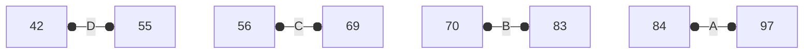

# $L3.1:$ Presentation of datasets in the form of a table

## Extracting data from cards

### Scores data

- Each card is a unit of information
- Different attributes or fields
  - Card ID, Name, Gender,..,Total
- Organize as table
- All the grades in a single table

<center>

|Id|Name|Gen|DoB|City|Math|Phys|Chem|Total|
|-|-|-|-|-|-|-|-|-|
|10|Kavya|F|12 Jan|Chennai|64|72|68|204|
|24|Siddharth|M|26 Dec|Madurai|44|72|58|174|
|17|Arshad|M|14 Dec|Chennai|62|81|67|210|
</center>

### Word in paragraph

<center>

Id|Word|Type|Length
-|-|-|-
24|Saturday|Noun|8
12|Considered|Verb|10
</center>

### Shopping Bills

- What are the attributes?
  - Bill ID, Shop Name, Customer Name
  - Item, Category, Qty, Price, Cost, Total
    - Variable number of rows per bill
- Variable Number of columns?
  - No longer a neat table!
Variable Number of rows per card?
  - Tag rows for each card

<center>

Id|Shop|Customer|Item|Category|Qty|Price|Cost|Total
-|-|-|-|-|-|-|-|-
5|Big Bazaar|Akshaya|Trousers|Women/Apparel|2|870|1740|4174
5|Big Bazaar|Akshaya|Shirts|Women/Apparel|1|1350|1350|4174
5|Big Bazaar|Akshaya|Detergent|Household|0.5|270|135|4174
5|Big Bazaar|Akshaya|Tee Shirts|Women/Apparel|4|220|880|4174
5|Big Bazaar|Akshaya|Instant Noodles|Canned/Food|3|23|69|4174
</center>

- Id, Shop, Customer and Total are duplicated in each row of the table.
- Problem is more pronounced as number of entries in the bill increase.

#### $Another\ solution:$ Multiple tables

<center>

Id|Shop|Customer|Total
-|-|-|-
5|Big Bazaar|Akshaya|4174

Id|Item|Category|Qty|Price|Cost
-|-|-|-|-|-
5|Trousers|Women/Apparel|2|870|1740
5|Big Bazaar|Akshaya|Shirts|Women/Apparel|1|1350|1350
5|Detergent|Household|0.5|270|135
5|Tee Shirts|Women/Apparel|4|220|880
5|Instant Noodles|Canned/Food|3|23|69
</center>

- One table has columns that are fixed for the bill
- Second table has variable entries as multiple rows
- Bill Id links the tables

## Summary

- Data on cards can be naturally represented using tables
- Each attribute is a column, and each card is a row in the table
- Difficulty if the card has variable number of attributes
  - Items in shopping bill
  - Multiple rows ---- Duplication of data
  - Split as separate tables ---- need to link via unique attribute

# $L3.2$ Below average students in two iterations (non-nested) and grade allocation

## Below average students

- Suppose we want to find out students who are not doing well, in the sense that they scored less than the average marks of all students.
- We can do this in two iterations
  - In the first iteration, we find out the average, and in the second iteration, we find out the students who scored less than average.
    - In the first iteration, we assign two variables `sum=0` which sums the total marks of all students and `count=0` which counts the total number of students.

<center>

| sum | ~~0~~ | ~~68~~ | ~~130~~ | ~~187~~ | ~~229~~ | ~~316~~ | ~~387~~ | ~~468~~ | ~~552~~ | ~~626~~ | ~~689~~ |
|---|---|---|---|---|---|---|---|---|---|---|---|
| count | ~~0~~ | ~~1~~ | ~~2~~ | ~~3~~ | ~~4~~ | ~~5~~ | ~~6~~ | ~~7~~ | ~~8~~ | ~~9~~ | ~~10~~ |
</center>

<center>

| sum | ~~752~~ | ~~850~~ | ~~902~~ | ~~967~~ | ~~1056~~ | ~~1132~~ | ~~1219~~ | ~~1281~~ | ~~1253~~ | ~~1409~~ |
|---|---|---|---|---|---|---|---|---|---|---|
| count | ~~11~~ | ~~12~~ | ~~13~~ | ~~14~~ | ~~15~~ | ~~16~~ | ~~17~~ | ~~18~~ | ~~19~~ | ~~20~~ |
</center>

<center>

| sum | ~~1502~~ | ~~1580~~ | ~~1642~~ | ~~1739~~ | ~~1783~~ | ~~1870~~ | ~~1944~~ | ~~2025~~ | ~~2099~~ | 2171 |
|---|---|---|---|---|---|---|---|---|---|---|
| count | ~~21~~ | ~~22~~ | ~~23~~ | ~~24~~ | ~~25~~ | ~~26~~ | ~~27~~ | ~~28~~ | ~~29~~ | 30 |
</center>

- Now the `avg=sum/count` becomes $2171/30=72.36$
- So the below-average scoring students (Id) are: 29,24,22,19,18,17,13,12,10,9,5,3,2,1,0

## Grade allocation

- Suppose we want to allocate grades to students according to their marks for Mathematics.
- We make 4 bands from low to high marks and allocate D, C, B, A.
- We want to make bands based on the range of marks scored by students (max marks - min marks).

<center>

max|101|68|87|97
-|-|-|-|-
min|-1|68|62|57|42

42 to 97 = 56


<br>
<table>
  <tr>
    <td>A</td>
    <td>25,23,16,14,11,7,4</td>
  </tr>
  <tr>
    <td>B</td>
    <td>29,28,27,26,21,18,15,8,6,5</td>
  </tr>
  <tr>
    <td>C</td>
    <td>22,19,17,13,10,9,2,1,0</td>
  </tr>
  <tr>
    <td>D</td>
    <td>24,12,3</td>
  </tr>
</table>

</center>

# $L3.3:$ Systematic process of hypothesis verification to find the relation between word length and frequency

- When we were looking at word frequencies, we noticed most frequent words are not long.
- To define long or short words we mean above or below the average number of letters per word.
  - After adding the letter count of all 65 words of the words dataset, it comes out to be 329.
    - Average letter count = $329/65\approx5$ 
    - $Long: \geq6$

<center>

|Word|it|was|monday|to|his|he|the|of|and|
|-|-|-|-|-|-|-|-|-|-|
|Frequency|2|3|3|2|2|2|6|3|3|

<table>
  <thead>
    <tr>
      <th>High frequency + Short</th>
      <th>High frequency + Long</th>
    </tr>
  </thead>
  <tbody>
    <tr>
      <td style="background-color:#0F02;width:50%">it, was, to, his, he, the, of, and</td>
      <td style="background-color:#F002;">monday</td>
    </tr>
    <tr>
      <td style="background-color:#F002;">cane, long, thin, with, class, very, at, work, mood, into, get, after, in, eyes, open</td>
      <td style="background-color:#0F02;">Headmaster, teacher, Vedanayagam, fire-eyed, building, yellow, dismal, school, thought, shuddered, discipline, difficult, sunday, saturday, freedom, delicious, calendar, unpleasant, specially, considered, reluctant, Swaminathan, morning</td>
    </tr>
  </tbody>
  <tfoot>
    <tr>
      <th>Low frequency + Short</th>
      <th>Low frequency + Long</th>
    </tr>
  </tfoot>
</table>
</center>

- Out of 47 distinct words, 31 (66%) are conforming to the hypothesis and 16 are refuting it.

# $L3.4:$ Three prizes problem

```
There is not much notes to write for this lecture. The lecture was mostly oral. Recommended to watch the lecture.
```
<details>
<summary>Lecture 3.4</summary>
<a href="https://www.youtube.com/watch?v=SAxoh4BREbg" target="_blank"></a>
</details>

# $L3.5:$ Introduction to procedures and parameters

```
There is not much notes to write for this lecture. The lecture was mostly oral. Recommended to watch the lecture.
```
<details>
<summary>Lecture 3.4</summary>
<a href="https://www.youtube.com/watch?v=_1oVAZOQDfI" target="_blank"></a>
</details>

# $L3.6:$ Pseudocode for procedures and parameters (Part 1)

- From the last week's Sum of Boys' Maths marks and Sum of Girls' Maths marks, the only thing that changed there was the `X.Gender` Condition.
- Generalizing the whole process as a procedure.

<table>
<tr>
<td width="50%" valign="top">

```
Procedure SumMaths(gen)
Sum = 0
while (Pile 1 has more cards){
  Pick a Card X from Pile 1
  Move X to Pile 2
  if(X.Gender==gen){
    Sum = Sum + X.Maths
  }
}
return(Sum)
end SumMaths
```

</td>
<td width="50%" valign="top">

- Procedure name: SumMaths
- Arguments receives value: gen
- Call procedure with a parameter SumMaths(F)
- Argument variable is assigned parameter value
- Procedure call SumMaths(F), implicitly starts with `gen=f`
- Procedure returns the value stored in `Sum`

</td>
</tr>
</table>

## A procedure to sum any type of number

<table>
<tr>
<td width="50%" valign="top">

- If we wanted to write the same procedure for Physics or Chemistry, the only change would be the X.Maths part.
- We can combine all these procedures into one procedure.
- Two parameters, gender(`gen`) and field(`fld`)
- `gen` is assigned a value, M or F, to check against `X`.gender
- `fld` is assigned a field name, to extract appropriate card entry `X`.fld
- Single procedure handles different requirements (combination of gender and field)

</td>
<td width="50%" valign="top">

```
Procedure SumMarks(gen,fld)
Sum = 0
while (Pile 1 has more cards){
  Pick a Card X from Pile 1
  Move X to Pile 2
  if(X.Gender==gen){
    Sum = Sum + X.fld
  }
}
return(Sum)
end SumMarks
```

</td>
</tr>
</table>

## Calling a procedure

<table>
<tr>
<td width="50%" valign="center">

```
GirlChemMarks = SumMarks(F, Chemistry)
BoyChemMarks = SumMarks(M, Chemistry)
if(GirlChemMarks >= BoyChemMarks){
  "Congratulate the girls"
}
else{
  "Congratulate the boys"
}
```

```
Sum = 0
...
UpdateMarks(17,Physics,88)
...
```

</td>
<td width="50%" valign="top">

- Use a procedure name like a math function, as part of an expression
- Assign the return value to a variable
- A procedure may not return a value
- Correct marks for one subject on a card
  - i.e.- Procedure UpdateMarks(cardId, subject, marks)
- Procedure call is a separate statement

</td>
</tr>
</table>

## Summary

- Procedures are pseudocode templates that work in different situations.
- Delegate work by calling a procedure with appropriate parameters.
  - Parameter can be a value, or a field name.
  - SumMarks(M, Total)
- Calling a procedure 
  - Procedure call is an expression, assign return value to a variable.
    - GirlChemMarks = SumMarks(F, Chemistry)
  - No useful return value, procedure call is a separate statement.
    - UpdateMarks(17, Physics, 88)
- Procedures help to modularize pseudocode.
  - Avoid describing the same process repeatedly.
  - If we improve the code in a procedure, the benefit automatically applies to all the procedure calls.

# $L3.7:$ Pseudocode for procedures and parameters (Part 2)

## Analysis of top students

- Is there a single student who is the best performer across all subjects?
- Is the highest overall total the same as the sum of the highest marks in each subject?
- Need to compute maximum for different fields in a scorecard.
  - Maths, Physics, Chemistry, Total
- Ideally suited to using procedures.
  - Same computation with a parameter to indicate the field of interest.

## Finding the maximum in a given field

<table>
<tr width="100%">
<td width="50%">

- As usual, keep track of the maximum using a variable.
  - Initialize to 0.
  - Update whenever you see a bigger value.
- The value to be compared is not fixed.
  - Parameter fld determines the field of interest.

</td>
<td width="50%">

```
Procedure Maxmarks(fld)
Maxval = 0
while(Pile 1 has more cards){
  Pick a card X from Pile 1
  Move X to Pile 2
  if(X.fld > Maxval){
    Maxval = X.fld
  }
}
return(Maxval)
end Maxmarks
```

</td>
</tr>
</table>

## Pseudocode for analysis of top students

<table>
<tr width="100%">
<td width="50%">

```
MaxMaths = Maxmarks(Maths)
MaxPhysics = Maxmarks(Physics)
MaxChemistry = Maxmarks(Chemistry)
MaxTotal = Maxmarks(Total)
SubjTotal = MaxMaths + MaxPhysics + MaxChemistry
if(MaxTotal == SubjTotal){
  SingleTopper = True
}
else{
  SingleTopper = False
}
```
</td>
<td width="50%">

- Use the procedure Maxmarks to find maximum marks in different categories.
  - Four Procedure calls, with fld set appropriately.
  - Save each return value separately.
- Use saved return values to compare the maximum overall total with the sum of the maximum subject totals.
</td>
</tr>
</table>

## $L3.8:$ Pseudocode for three prizes problem

### Want to award prizes to top 3 students

- Basic criterion is total marks.
- Must also be within the top three in at least one subject.
- Must select at least one boy and one girl for top three prizes.

### Basic pattern

- Find top three marks in a category.
- How is this to be done?

### Finding maximum

- Initialize `max=0`, scan cards, update `max` each time a value bigger than `max` is seen.

### Finding top two marks

- Maintain two values, `max` and `secondmax`.
- If the current value is bigger than max:
  - copy `max` to `secondmax`, update `max` to the current value.
- If the current value is between `max` and `secondmax`:
  - No change in `max`, update `secondmax` to the current value.

## Top three marks in a subject

<table>
<tr><td>

- Maintain `max`,`secondmax`,`thirdmax`.
- Scan through all the cards.
- Update `max`, `secondmax`, `thirdmax` as appropriate.
- Current value is:
  - Bigger than `max`.
  - Between `max` and `secondmax`.
  - Between `secondmax` and `thirdmax`.
- Need to return three values as a list<br>[$v_1$, $v_2$, $v_3$]?<br> Lists later..
- Sufficient to return `thirdmax`.
</td>
<td>

```
Procedure TopThreeMarks(Subj)
max = 0
secondmax = 0
thirdmax = 0
while(Pile 1 has more cards){
  Pick a card X from Pile 1
  if(X.Subj > max){
  thirdmax = secondmax
  secondmax = max
  max = X.subj
  }
  if(max > X.Subj > secondmax){
  thirdmax = secondmax
  secondmax = X.subj
  }
  if(secondmax > X.Subj > thirdmax){
  thirdmax = X.subj
  }
}

return(thirdmax)
End TopThreeMarks
```

</td></tr>
</table>

## Three prizes

- Top three totals such that top three in at least one subject.
  - Deal with boy/girl requirement later.
- Again, maintain and update `max`, `secondmax`, `thirdmax`.
- Scan through cards.
- For each card, update `max`, `secondmax`, `thirdmax` as before.
  - But only if top three of at least one subject!
  - Record third highest mark in each subject.
  - Compare with subject marks before updating `max`, `secondmax`, `thirdmax`.
- After scanning through all the cards, we have three prize-winning totals.
  - But who are the winners?
  - Keep track of the card number of prize winners.

<table>
<tr><td>

```
max = 0
secondmax = 0
thirdmax = 0

maxid = -1
secondmaxid = -1
thirdmaxid = -1

maths3 = TopThreeMarks(Maths)
phys3 = TopThreeMarks(Physics)
chem3 = TopThreeMarks(Chemistry)

while(Pile 1 has more cards){
  Pick a card X from Pile 1
  if(SubjectTopper(X,math3,phys3,chem3)){
    if(X.Total > max){
      thirdmax = secondmax
      secondmax = max
      max = X.Total
      thirdmaxid = secondmaxid
      secondmaxid = maxid
      maxid = X.Id
    }
    if(max > X.Total > secondmax){
      thirdmax = secondmax
      secondmax = X.Total
      thirdmaxid = secondmaxid
      secondmaxid = X.Id
    }
    if(secondmax > X.Total > thirdmax){
      thirdmax = X.Total
      thirdmaxid = X.Id
    }
  }
}
```

</td>
<td>

- Maintain `max`, `secondmax`, `thirdmax`, as well as `maxid`, `secondmaxid`, `thirdmaxid`.
- Record third highest mark in each subject.
- Scan through all the cards.
- Update `max`, `secondmax`, `thirdmax` as appropriate.
  - Only if top three in some subject --- new Procedure `SubjectTopper(...)`.
- In the end, we have what we need.

#### Variables of interest

- `maxid`, `max`
- `secondmaxid`, `secondmax`
- `thirdmaxid`, `thirdmax`

</td></tr>
</table>

## Subject topper

- Compare each subject's marks on the card with the highest number.
  - Passed explicitly as parameters.
- One or more comparisons should succeed --- or operator.

```
Procedure SubjectTopper(Card, MMark, PMark, CMark)
if(Card.Maths >= MMarks or Card.Physics >= PMark or Card.Chemistry >= CMarks){
  return(True)
}
else{
  return(False)
}
End SubjectTopper
```
- Value returned is a Boolean --- True or False.
- Typically, we would call this as follows:<br> <text style="background-color:#f505;border-radius:3px">`if(SubjectTopper(X, M, C, P) == True)`
- Since its boolean, we can simply call this as:<br> <text style="background-color:#5f05;border-radius:3px">`if(SubjectTopper(X, M, C, P))`

## Boundary conditions

- What if all the prize winners are from the same gender?
  - Exclude the third prize winner and repeat the process.
    - How many times?
    - Till we get three prize winners with at least one boy and one girl.
    - Will this give us three valid prize winners?
- What if there are ties?
  - How many ties can we tolerate?
  - Does it depend on the first, second or third position?

## Summary

- We have worked out a complex problem in full detail.
- Identify natural units to convert into procedures.
  - TopThreeMarks(Subj)
  - SubjectTopper(CardId, MMark, PMark, CMark)
- Shortcut for checking the return value of a procedure that returns a Boolean value.
  - If SubjectTopper(CardId, Maths3, Phys3, Chem3)
- Have to anticipate and account for unexpected situations in data.
  - All toppers are the same gender.
  - Ties.

# $L3.9:$ Side effects of procedure

## A procedure to sum up any type of marks

<table><tr><td>

- Two parameters, gender (gen) and field (fld).
- What about the set of cards?
- This procedure works for a fixed set of cards.
- Pass the deck of cards through a third parameter!
- Third parameter `Deck`.
- New variable `SeenDeck` for the second pile.
- `Deck` is modified as the procedure executes.
  - Cards move from `Deck` to `SeenDeck`.
- At the end of the procedure, `Deck` is empty!
- Procedure should also restore `Deck`.
- Is it sufficient?
</td><td>

```
Procedure SumMarks(gen,fld,Deck)
Sum = 0
while(Deck has more cards){
  Pick a card X from Deck
  Move X to seenDeck
  if(X.Gender == gen){
    Sum = Sum + X.fld
  }
}
Restore Deck from SeenDeck
return(Sum)
end SumMarks
```
</td></tr><table>

## Side effects

- What is the status of `Deck` after the procedure?
- Is each card the same as it was before?
  - We certainly expect so.
- Is the sequence of cards the same as it was before?
  - Perhaps not.
  - Depends on what we mean by restore `Deck`.
  - `SeenDeck` would normally be in reverse order.
-  <text style="background-color:#0f05;border-radius:3px;padding-left:5px;padding-right:5px">Side effect</text> Procedure modifies some data during its computation.
- The sequence of the cards may be disturbed.
- Does it matter?
  - Not in this case --- adding marks does not depend on how the cards are arranged.
- Sometimes the side effect is the end goal.
  - Procedure to arrange cards in decreasing order of Total marks.
- A side effect could be undesirable.
  - We pass a deck arranged in decreasing order of Total Marks.

## Interface vs implementation

- Each procedure comes with a contract.
  - Functionality
    - What parameters will be passed.
    - What is expected in return.
  - Data integrity
    - Can the procedure have side effects?
    - Is the nature of the side effect predictable?
- Contract specifies the interface.
  - Can change procedure implementation (code) provided the interface is unaffected.

## Side effects ...

<table><tr><td width="45%">
<text style="background-color:#29f5;border-radius:3px;padding-left:5px;padding-right:5px">It was Monday morning</text>. <text style="background-color:#fb15;border-radius:3px;padding-left:5px;padding-right:5px">Swaminathan</text> <text style="background-color:#29f5;border-radius:3px;padding-left:5px;padding-right:5px">was reluctant to open his eyes</text>. <text style="background-color:#f055;border-radius:3px;padding-left:5px;padding-right:5px">He</text> considered Monday specially unpleasant in the calendar. After the delicious freedom of Saturday and Sunday, it was difficult to get into the Monday mood of work and discipline. He shuddered at the very thought of school: that dismal yellow building; the fire-eyed Vedanayagam, his class-teacher; and the Head-Master with his thin long cane.

</td><td>

- Associating pronouns with nouns
  - Fix a<text style="background-color:#f205;border-radius:3px;padding-left:5px;padding-right:5px">pronoun
  - Search text <text style="background-color:#29f5;border-radius:3px;padding-left:5px;padding-right:5px">before</text> pronoun backwards
  - Stop at the nearest <text style="background-color:#fb15;border-radius:3px;padding-left:5px;padding-right:5px">name</text>
- Write a procedure for pronoun for matching
  - FindMatch(before, pronoun, after)
    - Three parameters
  - `FindMatch` should not disturb `before` and `after` 
    - Sequence of words, position
</td></tr></table>

## Summary

- Need to separate interface and implementation
- Interface describes a contract
  - Parameters to be passed
  - Value to be returned
  - What side effects are possible
- Can change the implementation provided we preserve the interface
- Side effects are important to be aware of
  - Sometimes no guarantee is needed (adding up mark)
  - Sometimes no side effect is tolerated (pronoun matching)
  - Sometimes the side effect is the goal (sort the data)
