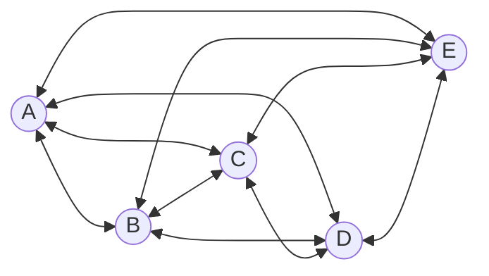
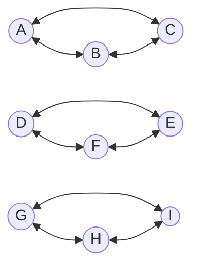

# $L4.1:$ Concept of nested iteration using birthday paradox (Naive approch)

- Birthday paradox is a counter-intuitive fact that if you have small group of people (less than 25), the probability that two people share same birthday is over 50%.
- To find fact check the statement we can use nested iteration in "Scores" dataset.

$Step 1:$  If `Pile 1` is empty, stop.

$Step 2:$  Pick a card (we'll call it `Card X`) from `Pile 1` and move it to `Pile 2`.

$Step 3:$  As long as `Pile 1` is not empty, repeat the following:
  - a. Pick a card (we'll call it `Card Y`) from `Pile 1`.
  - b. Compare the date of birth on `Card X` with the date of birth on `Card Y`.
  - c. If the birthdays match, you've found a pair.
  - d. Move `Card Y` to `Pile 3`.

$Step 4:$  Once `Pile 1` is empty, move all the cards from `Pile 3` back to `Pile 1`.

$Step 5:$  Go back to step 1.

# $L4.2:$ Concept of nested iteration using birthday paradox (Using Binning)

- when we were doing nested iteration for the birtday matching, the number of comparisions were increasing exponentially for more number of people.
- For 30 students we needed to do $\frac{(n-1)(n-1+1)}{2}=\frac{29\times30}{2}=435$ comparisons
- This methood is not very efficient
- If we group the cards based on birth months in to 12 groups or bins, and seperately run nested iterations on those bins the number of comparisons needed becomes much less.
- After binning we get the following result

Months|Cards amount|Comparisons Needed
-|-|-
Jan|3|3
Feb|2|1
Mar|4|6
Apr|1|0
May|4|6
June|1|0
Jul|3|3
Aug|1|0
Sep|3|3
Oct|2|1
Nov|2|1
Dec|4|6

Total Comparisons|30
-|-

- Binning might not always help for example if all the cards had birthday in december and in different days then binning by month would not help. in that case binnding by day might have helped.
- Looking at the data first gives us idea to how to solve a specific problem

# $L4.3:$ Importance of binning to reduce number of comparisons in nested iterations

## Reducing comparisons: What we observed

- Some computations seem to require comparisons of each card with all the other cards in the pile  
  - For example, choosing a study partner for each student  
    - The number of comparisons required can be very large
- We observed that if we can organise the cards into bins based on some heuristic:  
  - Then we only need to compare cards within one bin  
  - This seems to significantly reduce the number of comparisons required
- Is there a formal way of determining the reduction in comparisons?
  - Calculate the number of comparisons without binning  
  - Calculate the number of comparisons with binning  
  - Use these calculations to determine the reduction factor

## Comparing each element with all other elements

<table><tr><td><table><tr>

</tr><tr>

- For 5 elements A, B, C, D, E:
  - The comparisons required are:
    - A with B, A with C, A with D, A with E
    - B with C, B with D, B with E
    - C with D, C with E
    - D with E
  - A total number of 10 Comparisons

</tr></table></td><td>

- For N objects, the number of comparisons reqired will be 
  - (N-1) + (N-2) + ... + 1
  - Which is $=\frac{N\times(N-1)}{2}$
- This is the same as choosing 2 objects from N objects:
  - $^{N}C_{2}=\frac{N\times(N-1)}{2}$
- From first principles
  - Total number of pairs $N\times N$
  - From this reduce self comparisons (e.g. A with A). So number is reduced to: $N\times N - N$
  - which can be written as $N(N-1)$
  - Comparing A with B is the same as  comparing B with A,  so we are double counting this comparison
  - So, reduce the count by half  $\frac{N\times(N-1)}{2}$

</td></tr></table>

### The number of comparisons grow really Fast

N|2|3|4|5|6|7|8|9|10|100|100
-|-|-|-|-|-|-|-|-|-|-|-
(N(N-1)/2)|1|3|6|10|15|21|28|36|45|49,500|4,99,500

- The Number of comparisons is a quadratic function so it grows exponentially.

## Key Idea: Use binning

<table><tr><td>

</td><td>

- For 9 objects A, B, C, D, E, F, G, H, I:
  - Number of comparisons is  $1/2(9\times(9-1))=36$
- If the objects can be binned into 3 bins each:
  - The number of comparisons per bins is:  $1/2(3(3-1))=3$
  - Total number of comparisons for all bins is:  $3\times3$
- So the number of comparisons reduces from 36 to 9!
  - Reduced by a factor of 4 times.

</td></tr></table>

## Calculation of reduction due to binning

- For N items:
- Number of comparisons without binning is: $1/2\times N\times(N-1)$
- If we use K bins of equal size, number of comparisons per bin is: $1/2\times N/K\times (N/K-1)$
- Total Number of comparisons is: $K\times\frac{1}{2}\times\frac{N}{K}\times (\frac{N}{K}-1)= \frac{1}{2}\times N\times(\frac{N}{K}-1)$
- Factor of reduction is: $\frac{\frac{1}{2}\times N\times(N-1)}{\frac{1}{2}\times N\times(\frac{N}{K}-1)}=\frac{N-1}{\frac{N}{K}-1}$

- For N=9 and K=3, this is: (9-1)(9/3-1)=8/2=4

# $L4.4:$ Concept of binning to avoid the complexity of nested iterations

## Finding loyal customer

- Suppose we want to find out the customer who has shopped from only one store multiple times.
  - First we bin the bills according to the customer names
    - Now we compare shopping bills of the customer if thre are more than one bill, if all the bills are from same store then the customer is a loyal customer

Lecture 4.4

# $L4.5:$ Concept of fair teams

- Suppose we want to make sudy group pairs of student
- The maths marks of first student is significantly higer than second student and the physics marks of second student is significantly higher first student
- The maths+physics marks of both students are similar. for simplicity we are going to use total marks for this.
- we bin the score cards according to bins of 25 marks starting from 150 marks
  - Now within each bin we can find pair of students that fit out first criteria to make fair teams.

Lecture 4.5

# $L4.6:$ Procedure to find same date of birth for different students

Lecture 4.5

# $4.7:$ Procedure to resolve pronoun with its equivalent matching noun

Lecture 4.5

