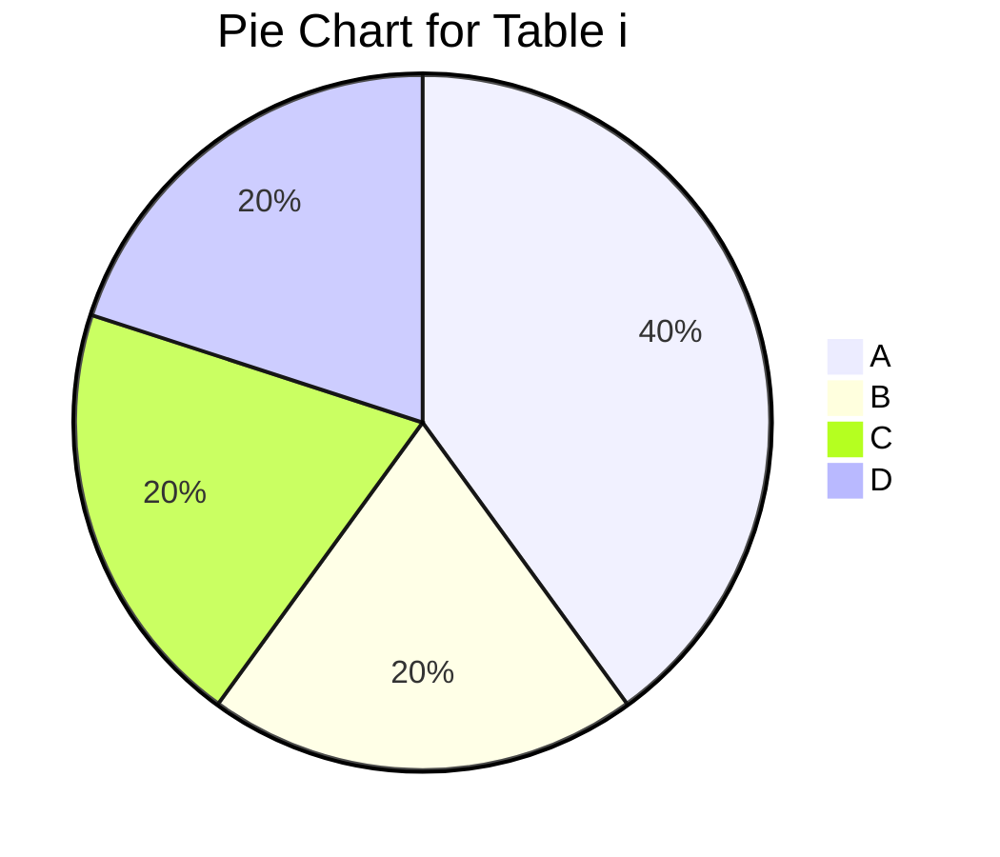
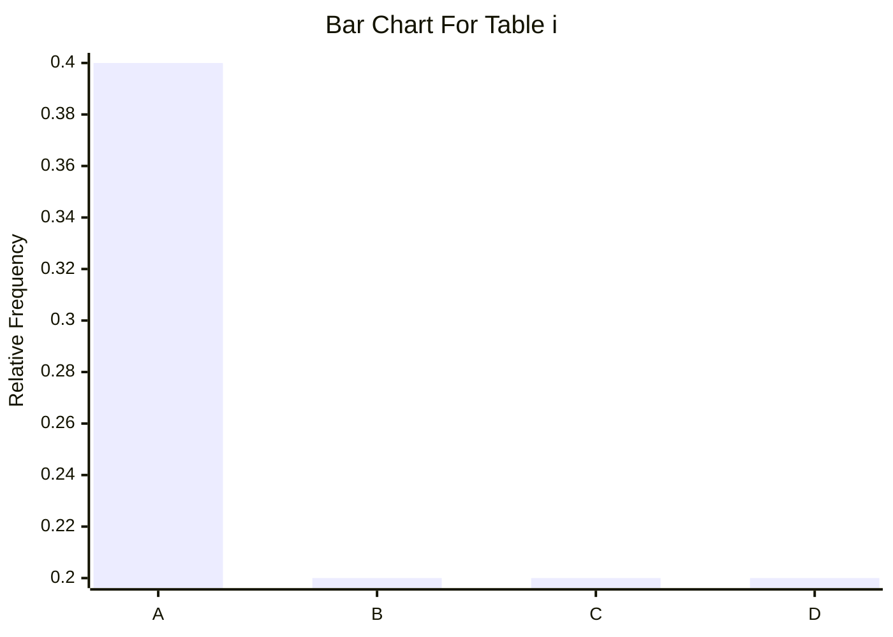
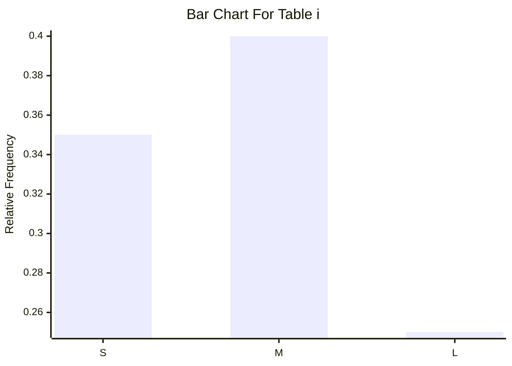
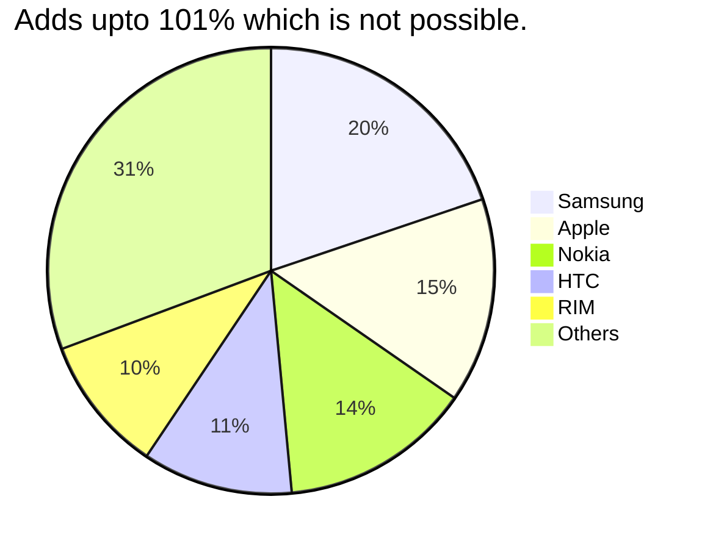
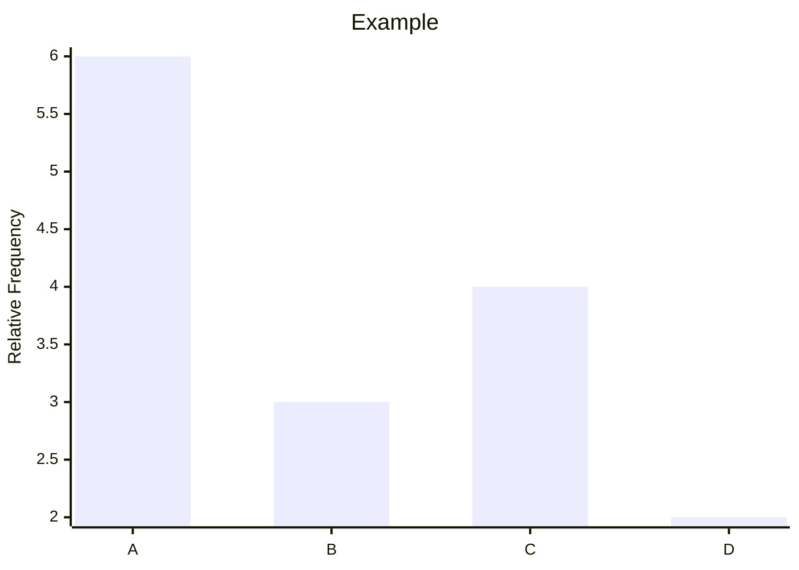
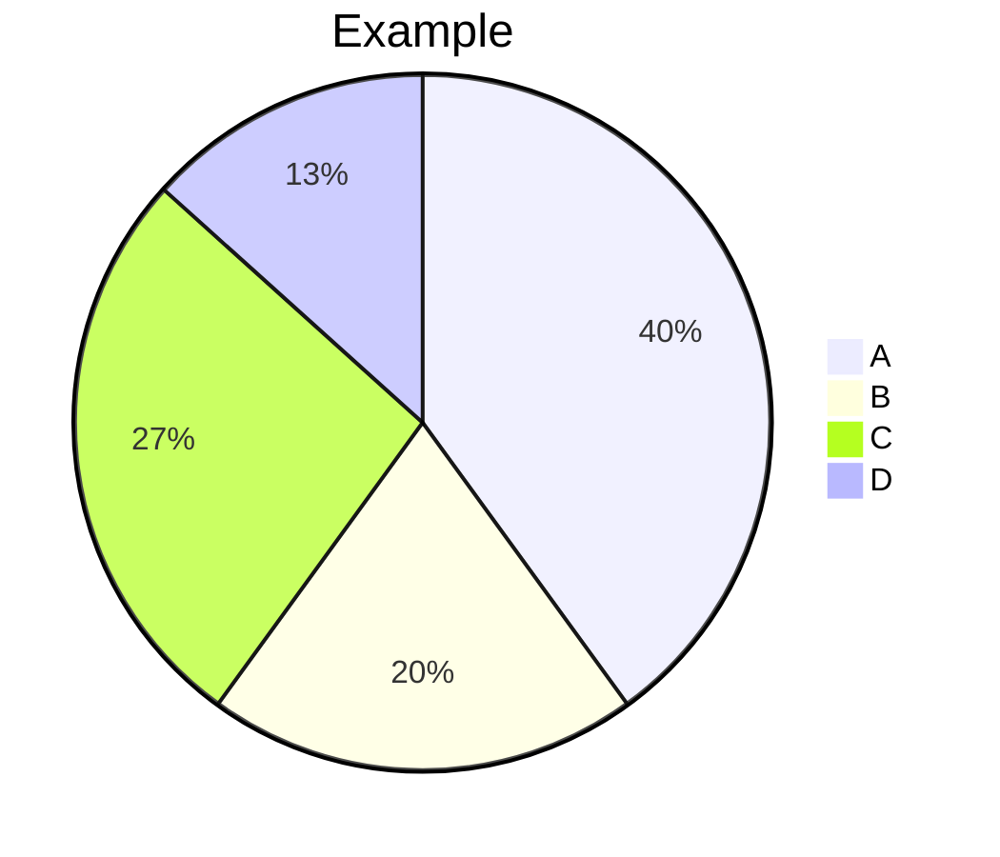
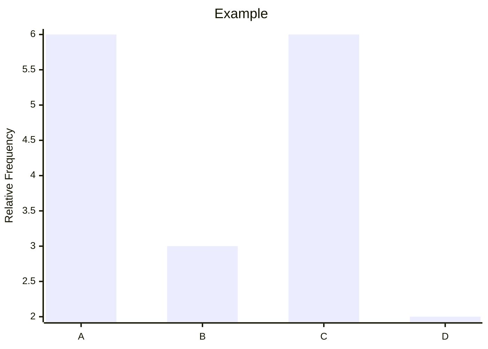

# Describing Categorical Data : Frequency distributions

#### $Defination:$ A frequency distribution of a qualitative data is a listing of the distinct values and their frequencies $(count)$.
- Each row of a frequency table lists a category along with the number of cases in this category.
- Steps to construct a frequency distribution
  - List the distinct values of the observation in the data set in the first column of a table.
  - For each observation, place a tally mark in the second column of the table in the row of the appropriate distinct value.
  - Count the tallies for each distinct value and record the totals in the third column of the table.
- $Example:$ Construct a frequency table for the given data $\to$
  <ol>
    <li>A,A,B,C,A,D,A,B,D,C</li>
    <li>A,A,B,C,A,D,A,B,D,C,A,B,C,D,A</li>
    <li>A,A,B,C,A,A,B,B,D,C,A,B,C,D,B</li>
  </ol>

 

|i|
|-|

|Category|Tally mark|Frequency|
|-|-|-|
|A|\|\|\|\||4|
|B|\|\||2|
|C|\|\||2|
|D|\|\||2|
|Total|~~\|\|\|\|~~ ~~\|\|\|\|~~|10|

|ii|
|-|

|category|tally mark|frequency|
|-|-|-|
|A|~~\|\|\|\|~~ \||6|
|B|\|\|\||3|
|C|\|\|\||3|
|D|\|\|\||3|
|Total|~~\|\|\|\|~~ ~~\|\|\|\|~~ ~~\|\|\|\|~~ |15|

|iii|
|-|

|category|tally mark|frequency|
|-|-|-|
|A|~~\|\|\|\|~~|5|
|B|~~\|\|\|\|~~|5|
|C|\|\|\||3|
|D|\|\|\||2|
|Total|~~\|\|\|\|~~ ~~\|\|\|\|~~ ~~\|\|\|\|~~|15|

- Frequency table in google sheets (excel)
  - Select/Hightlight the cells having data you want to visualize.
  - In the formatting bar click the data opetion.
  - In the data drop-down menu Select Pivot Table Editor and create a new sheet.
  - After creating Pivot table go in Pivot Table Editor and in that first add rows and then values.

## Relative Frequency

$Defination:$ The ratio of the frequency to the total number of observations is called relative frequency
- The steps to construct a relative frequency distribution 
  - Obtain a frequency distribution of the data.
  - Divide each frequency by the total number of observations.
- $Example:$

 

|i|
|-|

|Category|Tally mark|Frequency|Relative Frequency|
|-|-|-|-|
|A|\|\|\|\||4|0.40|
|B|\|\||2|0.20|
|C|\|\||2|0.20|
|D|\|\||2|0.20|
|Total|~~\|\|\|\|~~ ~~\|\|\|\|~~|10|1.00|

|ii|
|-|

|category|tally mark|frequency|Relative Frequency|
|-|-|-|-|
|A|~~\|\|\|\|~~ \||6|0.40|
|B|\|\|\||3|0.20|
|C|\|\|\||3|0.20|
|D|\|\|\||3|0.20|
|Total|~~\|\|\|\|~~ ~~\|\|\|\|~~ ~~\|\|\|\|~~ |15|1.00|

|iii|
|-|

|category|tally mark|frequency|
|-|-|-|
|A|~~\|\|\|\|~~|5|0.33|
|B|~~\|\|\|\|~~|5|0.33|
|C|\|\|\||3|0.20|
|D|\|\|\||2|0.13|
|Total|~~\|\|\|\|~~ ~~\|\|\|\|~~ ~~\|\|\|\|~~|15|1.00|

### Why relative frequency?

- For comparing two data sets.
- Because relative frequencies always fall between 0 and 1, they provide a standard for comparison.

# Describing Categorical Data : Charts of categorical data

- Two most common displays of categorical variable are a bar chart and pie chart.
- Both describe a categorical variable by displaying its frequency table.

## Pie Charts

$Defination:$ A pie chart is a circle divided into pieces proportional to the relative frequencies of the qualitative data.

 

|i|
|-|

|Category|Tally mark|Frequency|Relative Frequency|Degrees|
|-|-|-|-|-|
|A|\|\|\|\||4|0.40|$144\degree$|
|B|\|\||2|0.20|$72\degree$|
|C|\|\||2|0.20|$72\degree$|
|D|\|\||2|0.20|$72\degree$|
|Total|~~\|\|\|\|~~ ~~\|\|\|\|~~|10|1.00|$360\degree$|

 

- Pie Chart in google sheeet (excel)
  - Select/Highlight the cells having data you want to visualize.
  - Click the insert Chart option in Google Sheets toolbar.
  - Change the visualization type in chart editor.
  - Select in Chart Editor Chart Type to Pie Chart.

## Bar chart

$Defination:$ A bar chart displays the distinct values of the qualitative data on a horizontal axis and relative frequencies (or frequencies or percents) of those values on a vertical axis. The frequency/relative frequency of each distinct value is represented by a vertival bar whose height is equal to the frequency/relative frequency of that value. The bars should be positioned so that they do not touch each other.

- Steps to construct bar chart
  - Obtain a frequency/ relative frequency distribution of the data. 
  - Draw a horizontal axis on which to place the bars and a vertical axis on which to display relative frequencies.
  - For each distinct value, construct a whose height w equals the frequency of that value.
  - Label bars with with distinct values, the horizontal axis with the name of the variable, and the vertical axis with "Frequency"/"Relative Frequency"

- $Example:$

 

|i|
|-|

|Category|Tally mark|Frequency|Relative Frequency|
|-|-|-|-|
|A|\|\|\|\||4|0.40|
|B|\|\||2|0.20|
|C|\|\||2|0.20|
|D|\|\||2|0.20|
|Total|~~\|\|\|\|~~ ~~\|\|\|\|~~|10|1.00|$360\degree$|

 

- Bar Chart in google sheeet (excel)
  - Select/Highlight the cells having data you want to visualize.
  - Click the insert Chart option in Google Sheets toolbar.
  - Change the visualization type in chart editor.
  - Select in Chart Editor Chart Type to Bar Chart.

## Pareto Charts

- $Defination:$ When the categories in bar chart are sorted by frequency, the bar chart is Sometimes called a Pareto Chart. Pareto Charts are popular in quality controll to identify problems in a buisness process.
  - If the categorical variable is ordinal, then the bar chart must preserve the ordering.

- $Example(ordinal):$ The T-shirt sizes (small-S, medium-S, large-L) of twenty students are listed below:

L,M,M,S,L,S,S,M,L,M,M,S,S,L,M,S,M,S,L,M

|Size|Tally Mark|Freq|Relative Freq|
|-|-|-|-|
|Small|~~\|\|\|\|~~ \|\||7|0.35|
|Medium|~~\|\|\|\|~~ \|\|\||8|0.40|
|Large|~~\|\|\|\|~~|5|0.25|
|Total|~~\|\|\|\|~~ ~~\|\|\|\|~~ ~~\|\|\|\|~~ ~~\|\|\|\|~~|20|1.00|

# Describing Categorical Data : Mode and Median

## Best practices

### Round-off errors

- Important to check for round-off errors.
- When table entries are percentages or proportions, the total may sum to a value slightly different ffrom $100\%$ or 1. This might result in a pie chart where the totals does not add up.

#### Sectional Summery

-  Know your purpose and choose table/graph appropriately.
- Label your charts.
- Handle multiple categories appropriately.
- Respect area principle/
  - Avoid overly decorated graphs.
  - Avoid overly truncated graphs - use special symbols to indicate vertical axis has been modified.
  - Check for rounded-off errors.

## Summerizing categorical data

- Graphical summeries of categorical data: bar charts and pie charts.
- Need for a compact measure.
- Numbers that are used to describe sets are called descriptive measures.
- Descriptive measures that indicate where the center most typical value of data set lies are called measures of $Central\ tendency$.

## Mode

- $Defination:$ The $mode$ of a categorical variable is the most common category, the category with the highest frequency
- The mode labels
  - The longest bar in a bar chart.
  - The widest slice in a pie chart.
  - In a Pareto chart, the mode is the first category shown.
- $Example$
  - Let consider the example A,A,B,C,A,D,A,B,C,C,A,B,C,D,A
  - The longest bar in a bar chart

- - The most common category is "A"

- - The most common category is "A"

### Bimodal and Multimodal data

- If two of more categories tie for the highest frequency, the data is said to be bimodal(in case of two) or multimodal(more than two).

- $Example$
  - Let consider the example A,A,B,C,A,D,C,A,B,C,C,A,B,C,D,A,C

- Both category "A" and "C" have highest frequency.

## Median (Data must be ordinal)

 Ordinal data offer another summery, the median, that is not available unless the data can be put into order.

-  $Defination:$ The $median$ of an ordinal variable is the category of middle observation of sorted values.
  - If there are an even number of observations, choose the category on either side of median of the sorted list as the median. If its odd then choose the middle as median.
- $Example$
  - Consider the grades of 15 students which is listed as A,B,B,C,A,D,B,B,A,C,B,B,C,D,A
    - Sort them: 1.A ,2.A ,3.A ,4A. ,5.B ,6.B ,7.B ,8.B ,9.B ,10.B ,11.C ,12.C ,13.C ,14.D ,15.D
    - n = 15 = odd, The median grade is associated with the 8th observation which is "B".
  - Consider the graaded of 14 students which is listed as A,B,B,C,A,D,B,B,A,C,D,C,D,C 
   - Sort them: 1.A,2.A,3.A,4.B,5.B,6.B,7.B,8.C,9.C,10.C,11.C,12.D,13.D,14.D
   - n = 14 = even, The median grade associated with the 6th and 8th observation whic are "B" and "C"

- $Example:$ Consider the grades of 15 students is listed as: AA,B,B,C,A,D,B,B,A,C,,B,B,C,A,D,A,B,A,C,B,A,C,D,A
  - The ordered data is : A,A,A,A,A,A,B,B,B,B,C,C,C,D,D
  - The median grade is the 8th observation which is "B"
  - The most common grade is "A", hence mode is "A"
  - In this example both mode and median are different.

