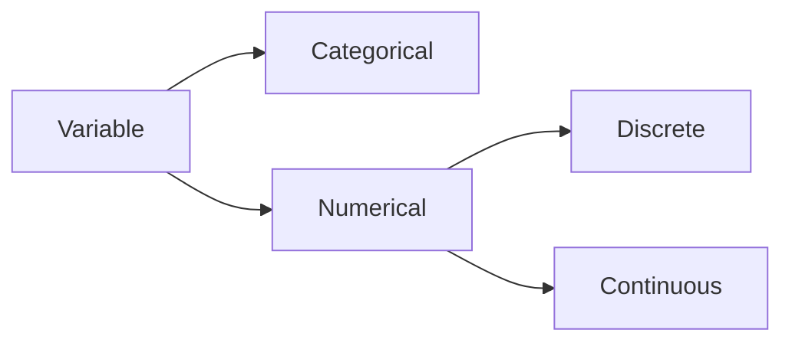
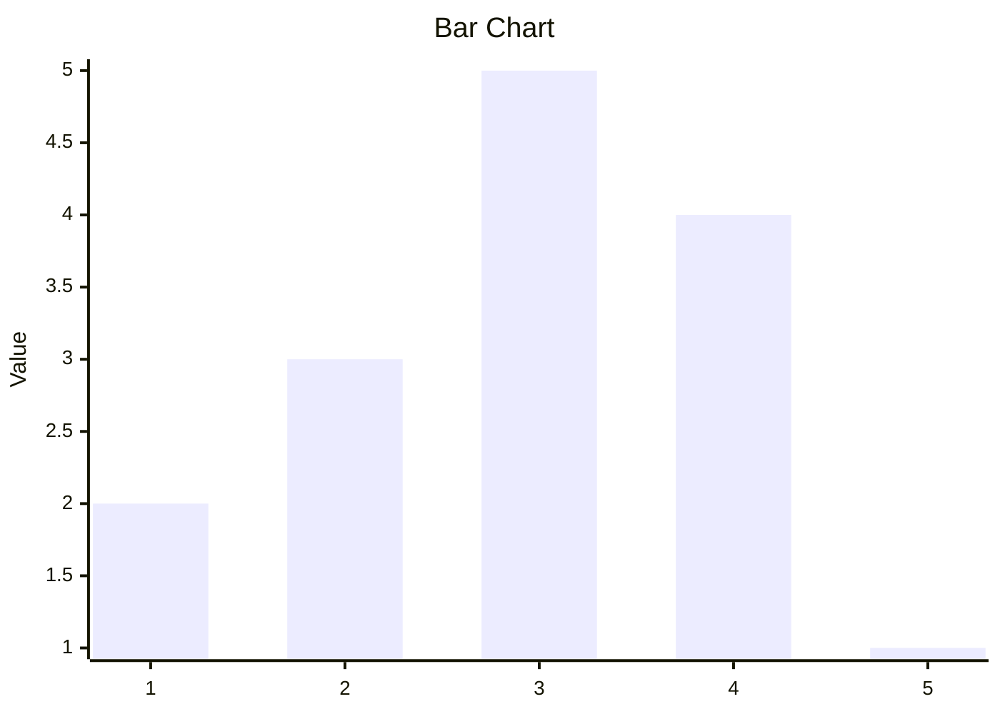

# Describing Numerical Data : Frequency Tables for numerical data

### Types of variables

<center>


</center>

## Organizing numerical data 

- Recall, a discrete variable usually involves a count of something, whereas a continuous variable usually involves a measurement of something.
- First group the observations into classes(also known as categories or bins) and then treat the classes as distinct values of qualitative data.
- Once we group the quantitative data into classes, we can construct frequency and relative frequency distributions of the data in exactly the same way as we did for categorical data.

### Organizing discrete data (single value)

- If the data set contains only a relatively small number of distinct, or different, values, it is convenient to represent it in a frequency table.
- Each class represents a distinct value (single value) along with frequency of occurence.

- $Example:$ Suppose the dataset reports the number of people in a household. The following data is the response from a 15 individuals.
  - 2,1,3,4,5,2,3,3,3,4,4,1,2,3,4
  - The distinct values the variable, number of people in each household, takes is 1,2,3,4,5.
  - The frequency distribution table is 

<center> 

|Value|Tally mark|Frequency|Relative frequency|
|-|-|-|-|
|1|\|\||2|0.13|
|2|\|\|\||3|0.2|
|3|~~\|\|\|\|~~|5|0.33|
|4|\|\|\|\||4|0.27|
|5|\||1|0.07|
|Total|~~\|\|\|\|~~ ~~\|\|\|\|~~ ~~\|\|\|\|~~|15|1|



</center>

### Organizing Continuous data

- Organize the data into a number of classes to make the data understandable. However, thre are few guidelines that need to be followed. They are
  - Number of classes: The appropriate number is a subjective choice, the rule of thumb is to have between 5 and 20 classes.
  - Each observation should belong to some class and no observation should belong to more than one class.
  - It is common, although not essential, to choose class interval of equal length.

#### Some terms 

- $Lower\ class\ limit:$ The smallest value that could go in class.
- $Upper\ class\ limit$ The largest value that could go in class.
- $Class\ width:$ The difference between the lower limit of a class and the lower limit of the next-higher class.
- $Class\ mark:$ The average of the two classs limits of a class.
- A class interval contains its left-end but not its right-end boundary point.

#### <text style="color:#5f5">$Example:$</text> 
- The marks obtained by 50 students in a particular course.
- 68,79,38,68,35,70,61,47,58,66,60,45,61,60,59,45,39,80,59,62,49,76,54,60,53,55,62,58,52,42,66,42,56,58

<center>

|Class interval|Tally mark|Frequency|Relative Frequency|
|-|-|-|-|
|30-40|\|\|\||3|0.6|
|40-50|~~\|\|\|\|~~ \||6|0.12|
|50-60|~~\|\|\|\|~~ ~~\|\|\|\|~~ ~~\|\|\|\|~~ \|\|\||18|0.36|
|60-70|~~\|\|\|\|~~ ~~\|\|\|\|~~ ~~\|\|\|\|~~ \|\||17|0.34|
|70-80|\|\|\|\||4|0.08|
|80-90|\|\|\||2|0.04|
|Total|~~\|\|\|\|~~ ~~\|\|\|\|~~ ~~\|\|\|\|~~ ~~\|\|\|\|~~ ~~\|\|\|\|~~ ~~\|\|\|\|~~ ~~\|\|\|\|~~ ~~\|\|\|\|~~ ~~\|\|\|\|~~ ~~\|\|\|\|~~ |50|1|

</center>

### Section Summery

- Frequency table for descrete single value data.
- Frequency table for continuous dato using class intervals.

## Histogram

### Steps to construct a Histogram

- Obtain a frequency (relative-frequency) distribution of the data.
- Draw a horizontal axis on which to place the classes and a vertical axis on which to display the frequencies (/relative frequencies).
- For each class, construct a vertical bar whose height equals the frequency (relative-frequency) of that class.
- Label the bars with the classes. the horizontal axis with the name variable, and the vertical axis with "frequency" ("relative-frequency").

<center>
<div style="background-color:#fff;border-radius:10px">

```chart
{
  "type": "bar",
    "data": {
      "labels": ["0-30","30-40","40-50","50-60","60-70","70-80","80-90"],
      "datasets": [{
        "label": "Frequency",
        "data": [0, 3, 6, 18, 17, 4, 2],
        "backgroundColor": "rgba(29, 133, 255)",
        "borderColor": "rgba(5, 1, 2, 1)",
        "borderWidth": 1,
        "barPercentage":1,
        "categoryPercentage":1,
        "beginAtZero": true
     }]
  }
}
```

</center>

## Stem and Leaf diagram

- $Defination:$ In stem and leaf diagram (or slemplot), each observation is seperated into two parts, namely, a stem-consisting off all but the rightmost digit and a leaf, the rightmost digit.
  - For example, if the data are all two-digit numbers, then we could let the stem of a data value be the tens digit and the leaf be the ones digit.
    - The value 75 is expressed x-axis
      - Stem $\to$ 7
      - Leaf $\to$ 5 
    - The two values 75,78 expressed as 
      - Stem $\to$ 7
      - Leaf $\to$ 5,8 

### Steps to construct a stemplot

- $Step\ 1:$ Think of each observation as stem --- consisting of all but the rightmost digit --- and a leaf, the rightmost figit.
- $Step\ 2:$ Write the stems from smallest to largest in vertical column to the left of a vertical rule.
- $Step\ 3:$ Write each leaf to the right of vertical rule in the row that contains the appropriate stem.
- $Step\ 4:$ Arrange the leaves in each row in ascending order.

#### Example

- The following are the ages, to the nearest year, of 11 patients addmitted in a certain hospital: 15,22,29,36,31,23,45,10,25,28,48

<center>

|Stem|Leaf|
|-|-|
|$1$|$0,5$|
|$2$|$2,3,9$|
|$3$|$2,3,5,8,9$|
|$4$|$5$|
</center>

## Section Summery

- Construct a histogramn for grouped data.
- Construct a slemplot to describe Numerical data.

# Describing Numerical Data : Mean

## Descriptive measures

- The objective is to develop measures thet can be used to summerize a data set.
- These descriptive measures are quantities whose values are determined by the data.
- The most commonly used descriptive measures can be categorized as 

#### Measures of central tendency

- $Defination:$ These are measures that indicate the most typical value or center of a dataset.

#### Measures of dispersion

- $Defination:$ These masures indicate the variabiltiy or spread of a dataset.

## The Mean

- The most commonly used measure of central tendency is the mean.
- $Defination:$ The mean of a dataset is the sum of the observations divided by the number of observations.
  - The mean is usually reffered to as average.
  - Arithmatic average; divide the sum of the values by the total number of values(another typical) value.
  - For discrete ovservations:
    - Sample mean:
    $$\bar{x}=\frac{x_1+x_2+\dots+x_n}{n}$$

    - Population mean:
    $$\mu=\frac{x_1+x_2+\dots+x_N}{N}$$
- $Example$
  - 2,12,5,7,6,7,3;
    $$\bar{x}=\frac{2+12+5+7+6+7+3}{7}=\frac{42}{7}=6$$
  - 2,105,5,7,6,7,3;
    $$\bar{x}=\frac{2+105+5+7+6+7+3}{7}=\frac{135}{7}=19.28$$
  - 2,105,5,7,6,3;
    $$\bar{x}=\frac{2+105+5+7+6+7}{6}=\frac{128}{6}=21.33$$
  -  The marks obtained by ten students in an exam is : 68, 79, 38, 68, 35, 70, 61, 47, 58, 66
     - The sample mean is 
     $$\frac{68+79+38+68+35+70+61+47+58+66}{10}=\frac{590}{10}=59$$

### Mean for grouped data: discrete single value data

- The following data is the response from 15 individuals.
  2, 1, 3, 4, 5, 2, 3, 3, 3, 4, 4, 1, 2, 3, 4

<center>

$$\bar{x}=\frac{f_1x_1+f_2x_2+\dots+f_nx_n}{n}$$

|$Value(x_i)$|$Frequency(f_i)$|$f_ix_i$|
|-|-|-|
|1|2|2|
|2|3|6|
|3|5|15|
|4|4|16|
|5|1|5|
|$Total$|15|44|

$$Mean=\frac{44}{15}=2.93$$

</center>

### Mean for grouped data: continuous data

<center>

$$\bar{x}=\frac{f_1x_1+f_2x_2+\dots+f_nx_n}{n}$$

|$Class\ interval$|$Frequency(f_i)$|$Mid\ point(m_i)$|$f_im_i$|
|-|-|-|-|
| 30-40 | 3 | 35 | 105 |
| 40-50 | 6 | 45 | 270 |
| 50-60 | 18 | 55 | 990 |
| 60-70 | 17 | 65 | 1105 |
| 70-80 | 4 | 75 | 300 |
| 80-90 | 2 | 85| 170 |
| Total | 50 | | 2940 |

$$Average=\frac{2940}{50}=58.8$$

</center>

#### 58.8 is an approximate and not exactly value of the mean

## Adding a constant

- Let $y_i=x_i+c$ where c is a constant then $\bar{y}=\bar{x}+c$
- Example: Recall the marks of the students
  -  68, 79, 38, 68, 35, 70, 61, 47, 58, 66
  - Suppose the teacher has decided to add 5 marks to each student.
  - then the data becomes
    - 73, 84, 43, 73, 40, 75, 66, 52, 63, 71
    - The mean of the new data set is $\frac{640}{10}=64=59+4$

## Multiplying a constant

- Let $y_i=x_i+c$ where c is a constant then $\bar{y}=\bar{x}+c$
- Example: Recall the marks of the students
  -  68, 79, 38, 68, 35, 70, 61, 47, 58, 66
  - Suppose the teacher has decided to scale down each mark by $40\%$, in other words each mark is multiplied by 0.4.
  - then the data becomes
    - 27.2, 31.6, 15.2, 27.2, 14, 28, 24.4, 18.8, 23.2, 26.4
    - The mean of the new data set is $\frac{236}{10}=23.6=59\times0.4$

# Describing Numerical Data : Median and Mode

## Median

Another frequently used measure of center is the median. Essentially, the median of a dataset is the number that divides bottom $50\%$ of the data to the top $50\%$
- $Defination:$ The median of a data set is the middle value in its ordered list.
- $Steps\ to\ obtain\ median:$
  - Arrange the data in increasing order. Let n be the total number of observations in the dataset.
    - If the number of observations is odd, then the median is the observation exactly in the middle of the ordered list, i.e. $\frac{n+1}{2}$ observation.
    - If the number of observations is even, then the median is the mean of the two middle observations in the ordered list, i.e. The mean of $\frac{n}{2}$ and $\frac{n}{2}+1$ observation.
  - $Example:$
    - 2,12,5,7,6,7,3 
      - Arrange the data in increasing order: 2,3,5,6,7,7,12 
      - n=7 odd, median is the $\frac{n+1}{2}=\frac{8}{2}=4^{th}$ observation, "6".
    - 2,117,5,7,6,7,3
      - Arrange the data in increasing order: 2,3,5,6,7,7,105 
      - n=7 odd, median is the $\frac{n+1}{2}=\frac{8}{2}=4^{th}$ observation, "6".
    - 2,105,5,7,6,3
      - Arrange the data in increasing order: 2,3,5,6,7,105 
      - n=6 even, median is the mean of $\frac{n}{2}=\frac{6}{2}=3^{th}$ "5" and $\frac{n}{2}+1=\frac{6}{2}+1=4^{th}$ "6" $\Rightarrow$ $\frac{5+6}{2}=5.5$.

#### $Note:$ The sample mean is sensitive to outliers, whereas the sample median is not.

- $Example:$
  - 2,12,5,7,6,7,3 
    - Sample mean: $\frac{2+3+5+6+7+7+12}{7}=6$
    - Sample median: 6
  - 2,117,5,7,6,7,3
    - Sample mean: $\frac{2+3+5+6+7+7+117}{7}=21$
    - Sample median: 6

### Adding a constant

- Let $y_i= x_i+c$ where c is a constant then the new median = old median + c
- $Example:$ Recall the marks of students $\to$ 68,79,38,68,35,70,61,47,58,66.
  - Arrange them in ascending order : 35,38,47,58,61,66,68,68,70,79
  - The median for the data is the average of $\frac{n}{2}$ and $\frac{n}{2}+1$ observation which is $\frac{61+66}{2}=63.5$ 
  - Suppose the teacher has decided to add 5 marks to each student. 
  - Then the data in ascending order is : 40,43,52,63,66,71,73,73,75,84
  - The new median is $\frac{66+71}{2}=88.5=63.5+5$

### Multiplying a constant

- Let $y_i= x_ic$ where c is a constant then the new median = $old\ median \times c$
- $Example:$ Recall the marks of students $\to$ 68,79,38,68,35,70,61,47,58,66.
  - We already know the median for this data is 63.5
  - Suppose the teacher wants to scale down each mark by $40\%$, in other worlds the mark is multiplied by 0.4.
  - Then the data becomes: 27.2,31.6,15.2,27.2,14,28,24.4,18.8,23.2,26.4
  - The ascending order is: 14,15.2,18.8,23.2,24.4,26.4,27.2,27.2,28,31.6 
  - The new median of the dataset is $\frac{24.4+26.4}{2}=25.4= 63.5\times0.4$

## Mode

Another measure of central tendency is the sample mode.
- $Defination:$ The mode of a dataset is its most frequently occuring value.
- $Steps to obtain mode:$ 
  - If no value occurs more than once, then the data has no mode.
  - Else the value that occurs with the greatest frequency is a mode of the data set.
- $Example:$
  - 2,12,5,7,6,7,3;
    - 7 occurs twice, hence 7 is mode.
  - 2,105,5,7,6,3
    - There is no mode in this dataset.

### Adding a constant

- Let $y_i= x_i+c$ where c is a constant then the new mode = old mode + c
- $Example:$ Recall the marks of students $\to$ 68,79,38,68,35,70,61,47,58,66.
  - The mode for this data is 68.
  - Suppose the teacher has decided to add 5 marks to each student. 
  - Then the data in ascending order is : 40,43,52,63,66,71,73,73,75,84
  - The new mode is $73 = 68+5$

### Multiplying a constant

- Let $y_i= x_ic$ where c is a constant then the new mode = $old\ mode \times c$
- $Example:$ Recall the marks of students $\to$ 68,79,38,68,35,70,61,47,58,66.
  - We already know the mode for this data is 68
  - Suppose the teacher wants to scale down each mark by $40\%$, in other worlds the mark is multiplied by 0.4.
  - The new data in ascending order is: 14,15.2,18.8,23.2,24.4,26.4,27.2,27.2,28,31.6 
  - The new mode is $27.3=68\times0.4$

## Sectional Summery

- Measures of central tendency
  - Mean
  - Median
  - Mode
- Impact of adding a constant or Multiplying with a constant on the measures.

# Describing Numerical Data : Measures of dispersion

## Why do we need a measure of dispersion?

- Consider the two datasets given below
  - Dataset 1: 3,3,3,3,3
  - Dataset 2: 1,2,3,4,5
- The masures of central tendency for both the data set are

<center>

||Dataset 1|Dataset 2|
|-|-|-|
|Mean|3|3|
|Median|3|3|
|3||Not available|

</center>

- The mean, median are same for both the datasets. However, the datasets are not same. They are very different.

## Measures of Dispersion 

- To describe that difference qualitatively, we uer a descriptive measures that indicates the amount of variation, or spread, in a dataset.
- Such descriptive measures are reffered to as 
  - measures of dispersion, or 
  - measures of variation, or 
  - measures of spread.
- We will be discussing about the following measures of dispersion
  - Range.
  - Variance.
  - Standard deviation.
  - Interquartile range.

## Range

- $Defination:$ The range of a dataset is the difference between its largest and smallest values.
  - The range of a dataset is given by the formula 
    - Range = Max - Min $\ |$  ```Where Max and Min denote the maximum and the minimum observations, respectively```

<center>

||Dataset 1|Dataset 2|
|-|-|-|
||3,3,3,3,3|1,2,3,4,5|
|Max|3|5|
|Min|3|1|
|Range|0|4|

</center>

#### Range is sensitive to outliers 

- In the exmple , Though the two datasets differ only in one datapoint, we can see that this contributes to the value of range significantly. This happens because the range takes into consideration only the min and max of the dataset.

## Variance

- In constrast to the range, the varience  takes into account all observations.
- One way of measuring the variabiltiy of a dataset is to consider the deviations of the data values from a central value.

### Population varience vs Sample varience

- Recall when we refer to a dataset from a population, we assume the dataset has N observations, whereas, when refer to a dataset from a sample, we assume the dataset has n observations.
  - The varience is computed using the following formulae.
    - Population Varience: $\sigma^2=\frac{(x_1-\mu)^2+(x_2-\mu)^2+\dots+(x_N-\mu)^2}{N}$
    - Sample Variance $s^2=\frac{(x_1-\bar{x})^2+(x_2-\bar{x})^2+\dots+(x_n-\bar{x})^2}{n-1}$
  - The numerator is the sum of squared deviations of every observation from its mean.
  - The denominator for computing population varience is N, the total number of observations.
  - The denominator for computing sample varience is $(n-1)$. The reason for this will be clear in forthcoming courses on statistics.


